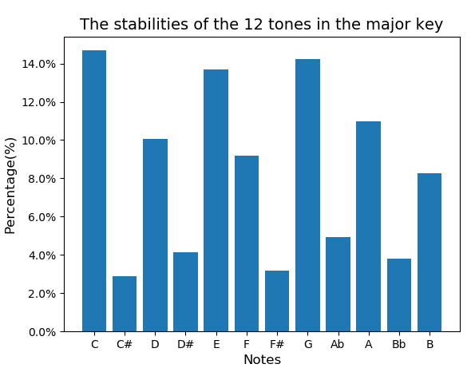

# 궁금해서 해보는 주말 작업

궁금해서 해보는 주말 작업

### 목적

각 음악의 장르별로, 노트의 출현 빈도를 알아 보자

### 사용한 리소스

https://www.kaggle.com/ 의 Classical Music MIDI (License: Unknown)

### 결과

샘플에 사용된 class 음악에서는 Normalize한 각 음의 출현 빈도는 다음과 같았다.

**Major scale**
|   | diatonic            | #                    |
|---|:---:                |:---:                 |
| C | 0.14682092802002900 | 0.028956985452448614 |
| D | 0.10050002774795185 | 0.041556378185490860 |
| E | 0.13700031660740725 |                      |
| F | 0.09182287004186956 | 0.031721960162180894 |
| G | 0.14232373932256265 | 0.049127894682064265 |
| A | 0.10981539571794353 | 0.037863961303099776 |
| B | 0.08248018149817357 |                      |

하지만 다른 장르들을 돌려 보면, `F`나 `Bb`의 비중이 이것보다는 높게 나온다.

그리고 또 다른 5000개의 샘플을 처리한 결과에서 minor만 빼보면 다음과 같은 결과가 나왔다.

**Minor scale**
|   | diatonic            | #                    |
|---|:---:                |:---:                 |
| A | 0.17754856422578050 | 0.01734016668838689 |
| B | 0.05585368001739888 |                     |
| C | 0.20012836106728596 | 0.01038506450331241 |
| D | 0.10289527358659997 | 0.01579788884604861 |
| E | 0.15581993225743038 |                     |
| F | 0.09147006644965223 | 0.02086356005499137 |
| G | 0.13924875236366113 | 0.01264868993945183 |

### Reference

고전적으로는 아래의 통계 자료를 사용한다.  
하지만 제대로 하려면 **장르별**로 다른 값을 써야 할 것 같다.

CBMS profiles:
- major_profile = `5.0 2.0 3.5 2.0 4.5 4.0 2.0 4.5 2.0 3.5 1.5 4.0`
- minor_profile = `5.0 2.0 3.5 4.5 2.0 4.0 2.0 4.5 3.5 2.0 1.5 4.0`

Bayesian profiles (based on frequencies in Kostka-Payne corpus):
- major_profile = `0.748 0.060 0.488 0.082 0.670 0.460 0.096 0.715 0.104 0.366 0.057 0.400`
- minor_profile = `0.712 0.084 0.474 0.618 0.049 0.460 0.105 0.747 0.404 0.067 0.133 0.330`

Krumhansl's profiles:
- major_profile = `6.35 2.23 3.48 2.33 4.38 4.09 2.52 5.19 2.39 3.66 2.29 2.88`
- minor_profile = `6.33 2.68 3.52 5.38 2.60 3.53 2.54 4.75 3.98 2.69 3.34 3.17`
- Krumhansl's minor, normalized:
  - `5.94 2.51 3.30 5.05 2.44 3.31 2.38 4.46 3.73 2.52 3.13 2.97`
